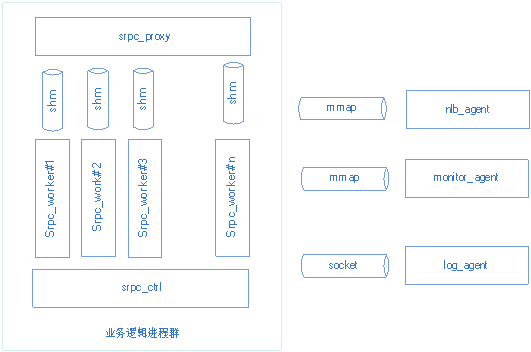
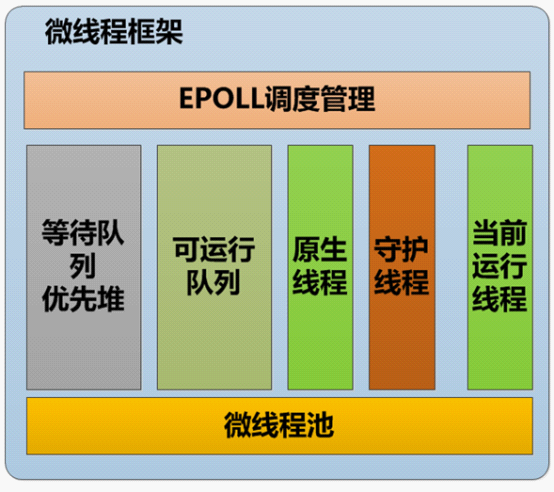

# c++开发者手册 #

**MSEC** 是一个开发+运营解决方案，不只是一个开发框架。支持Java、C/C++、PHP和Python开发语言，其中后三种语言底层框架都是基于C++开发的逻辑层框架。本文主要介绍框架原理和C/C++接口使用。

## SRPC简介 ##

**SRPC** 是一个典型的逻辑层框架融合RPC和MSEC外围系统的产物，主语言采用C++/C，并对PHP和Python提供了简单支持，有如下特点:

- **微线程**<br/>协程库，具有同步编码、异步执行、高性能、支持多并发等特点
- **插件化**<br/>开发简单，开发者只需要实现几个接口，并提供业务插件(动态库)给框架加载，即可实现业务调用
- **协议**<br/>采用google的protobuf协议做为标准协议，自动生成代码，使用简单
- **名字服务**<br/>采用MSEC内部使用的自适应网络负载均衡*NLB*做名字服务
- **负载均衡**<br/>采用MSEC内部使用的自适应网络负载均衡*NLB*做负载均衡
- **服务监控**<br/>采用MSEC内部使用的打点监控系统*Monitor*
- **日志**<br/>支持本地日志和远程日志，远程日志采用MSEC内部使用的日志系统，支持染色

### 整体框架 ###




如上图所示，SRPC框架分三类进程：<br/>

- **srpc_ctrl**<br/>controller进程，单个进程，负责管理proxy、worker进程，包括启动、心跳监控、进程异常拉起等工作
- **srpc_proxy**<br/>proxy进程，单个进程，负责客户端的连接管理、收发包、给ctrl进程上报心跳等工作
- **srpc_worker**<br/>worker进程，多个进程，负责调用业务的主题处理逻辑、给ctrl进程上报心跳等工作

*proxy*和*worker*进程通过两块共享内存+fifo通知机制完成交互。一块共享内存proxy负责发包，worker收包；另外一块worker发包，proxy收包。所有进程通过mmap和socket的方式，与三个agent进程交互，实现路由信息的获取、监控上报、日志上报。

### 微线程简介 ###
**微线程**是一个*协程*库，一些语言(golang,erlang等)已经提供了语言级别的支持，但是C语言并没有提供支持，有一些开源的C语言库提供了类似的支持，比如：libco、libtask、coro、libpcl、State Threads等。<br/>

类似于apache的fork模型，网络服务器，每次收到报文，都创建一个执行环境来单独处理，差异在于不是进程，而是微线程； 每个线程，有独立的栈空间，其执行过程与其它线程隔离。对比于posix的线程，“微线程”是用户态的调度，实质上，多个“微线程”是同一操作系统调度单元，而微线程间的调度，是用户态进程内部管理的，也就是说，每次微线程切换，不用进入系统态，开销会小很多。

切换原理借鉴了setjmp/longjmp 的思路，将线程切换的断点，锁定在setjmp返回的地址上，保存的上下文，也只用存储callee-saved 的系列寄存器（caller-saved寄存器，理应还在栈中存储），考虑到可扩展，“微线程”这里采用汇编的方式，重写了setjmp/longjmp接口，如果需要，可以存储更多的上下文信息。



如上图所示，微线程的调度原理主要基于epoll、等待队列和可运行队列，是非抢占式的。微线程在空闲时（网络IO阻塞或其它事件等待时）加入等待队列，主动让出CPU；如果IO满足或者其它事件到达，加入可运行队列；守护微线程负责整体的IO和微线程调度。

## SRPC编码 ##
本节主要采用一两个事例程序来完成编码的说明。

### 协议定义 ###
SRPC的协议使用*protobuf*，协议的定义实际上就是一个proto文件。在MSEC中，开发同学只需要在页面上定义好协议即可。后续章节描述如无特殊说明，都采用如下协议做示例。

```protobuf
// 包名, 建议小写 linux 命令风格: echo
package echo;

// 请求消息定义
message EchoRequest
{
    optional bytes message  = 1;
}

// 应答消息定义
message EchoResponse
{
    optional bytes message  = 1;
}

// 定义服务, 建议首字符大写，只允许定义一个
service EchoService
{
    // 定义方法, 可以多份
    rpc Echo(EchoRequest) returns (EchoResponse);
}

option cc_generic_services = true; // 生成RPC，这行必须加上
```


### 自动生成代码 ###

SRPC通过开发者定义的协议格式，可以自动生成对应的代码，业务开发者只需要关注业务的逻辑即可。在MSEC中，自动生成的代码通过页面完成。以上文中的echo为例，生成后的代码下载下来的目录如下：

```
echo_server echo_client include lib
echo
|-- echo_client		// 客户端示例代码
|   |-- Makefile
|   |-- client_echo_sync.cpp
|   `-- service.proto
|-- echo_server		// 服务器端代码
|   |-- Makefile
|   |-- msg_echo_impl.cpp   // 业务可在该文件实现业务逻辑
|   |-- msg_echo_impl.h
|   |-- service.pb.cc
|   |-- service.pb.h
|   |-- service.proto
|   |-- service_echo_frm.cpp
|   `-- service_echo_impl.hpp
|-- include
|   |-- pb			// protobuf头文件
|   |-- spp_incl	// spp头文件
|   |-- sppincl.h
|   |-- srpc_incl   // rpc头文件
|   |-- srpcincl.h
|   |-- sync_incl   // 微线程头文件
|   `-- syncincl.h
`-- lib
    |-- libmt.a
    |-- libpb32.a
    |-- libpb64.a
    |-- librpc_clt_comm.a
    `-- protoc		// pb生成代码工具
```

### 实现业务逻辑 ###

业务实现逻辑都在msg_$(packagename)_impl.cpp里面实现，上例中的RPC方法名是Echo，包名是echo，可以在msg_echo_impl.cpp里面找到Echo方法的实现接口（TODO下面为简单代码实现）：

```c++
/**
 * @brief  自动生成的业务方法实现接口
 * @param  request  [入参]业务请求报文
 *         response [出参]业务回复报文
 * @return 框架会将返回值作为执行结果传给客户端
 */
int CEchoServiceMsg::Echo(const EchoRequest* request, EchoResponse* response)
{
    /**
     * TODO 业务逻辑实现，request/response为业务业务定义的protobuf协议格式
     *      业务可使用框架自带的监控系统 ATTR_REPORT("test"), 详见monitor.h
     *      业务可使用框架自带的日志系统 NGLOG_DEBUG("test")，详见srpc_log.h
     */
    if (request->message() == "hello world")
    {
        response->set_message("hello world");
    }
    else
    {
        response->set_message("invalid message");
    }

    return 0;
}
```

#### 业务初始化 ####

如果业务需要在进程启动和停止的时候，需要做一些初始化和清理工作，可以修改service_$(package)_frm.cpp下面的代码实现。

```c++
/**
 * @brief 业务模块初始化插件接口(proxy,worker)
 * @param conf -业务配置文件信息
 * @param server -业务进程信息
 * @return 0 - 成功, 其它失败
 */
extern "C" int spp_handle_init(void* arg1, void* arg2)
{
    int32_t ret = 0;
    const char* etc = (const char*)arg1;
    CServerBase* base = (CServerBase*)arg2;
    NGLOG_DEBUG("spp_handle_init, config:%s, servertype:%d", etc, base->servertype());

    if (base->servertype() == SERVER_TYPE_WORKER) // WORKER进程初始化
    {
        // 注册RPC服务与消息信息
        ret += CMethodManager::Instance()->RegisterService(new CRpcEchoServiceImpl, new CEchoServiceMsg);
        if (ret != 0)
        {
            NGLOG_ERROR("service regist failed, ret %d", ret);
            return -1;
        }
    }

    // TODO: 业务初始化

    return 0;
}

/**
 * @brief 业务服务终止接口函数(proxy/worker)
 * @param server -业务进程信息
 */
extern "C" void spp_handle_fini(void* arg1, void* arg2)
{
    CServerBase* base = (CServerBase*)arg2;
    NGLOG_DEBUG("spp_handle_fini");

    if (base->servertype() == SERVER_TYPE_WORKER )
    {
        CSyncFrame::Instance()->Destroy();
    }

    // TODO: 业务去初始化
}

```


### 服务间调用 ###

SRPC服务主要分为两类：标准服务和异构服务。异构服务又分为两类：SRPC和非SRPC。这里按照3类解释说明：

- 标准服务<br/>SRPC服务，且和存在调用关系的业务在同一个实例。
- SRPC异构服务<br/>SRPC服务，且和存在调用关系的业务不在同一个实例。
- 非SRPC异构服务<br/>	非SRPC服务。

#### SRPC业务调用其它服务 ####

##### 调用标准服务 #####

对于MSEC内部的业务，可以直接调用CallMethod完成RPC调用。

```c++
/**
 * @brief  框架内部调用方法接口
 * @param  service_name  业务名   一级业务名.二级业务名 "Login.ptlogin"
 *         method_name   方法名   方法名的pb全称"echo.EchoService.Echo"
 *         request       请求报文
 *         response      回复报文
 *         timeout       超时时间
 * @return SRPC_SUCCESS  成功
 *         其它          失败
 */
int32_t CallMethod(const std::string& service_name,
 				   const std::string &method_name,
                   const Message &request,
                   Message &response,
                   int32_t timeout)
```
	
以调用echo为例：

```c++
int32_t ret;
EchoRequest request;
Request.set_message("hello world");

EchoResponse response;
ret = CallMethod("Login.ptlogin", "echo.EchoService.Echo", request, response);
if (ret != SRPC_SUCCESS)
{
    cout << errmsg(ret) << endl;
}
```

参数说明：

```
Login.ptlogin   		业务名，web console录入，两级业务名
echo.EchoService.Echo	方法名，pb自动生成的方法名全称
Request				    请求包
Response				回复包
```

##### 调用SRPC异构服务 #####

需要通过SRPC提供的代理调用，调用接口如下：

```c++
/**
 * @brief 第三方法调用接口
 * @info  第三方协议调用接口
 * @param request    请求报文buffer
 *        req_len    请求报文长度
 *        response   回复报文buffer，接口malloc申请，调用者需要free释放
 *        rsp_len    回复报文长度
 *        timeout    超时时间
 * @return SRPC_SUCCESS 成功
 *         其它         失败
 */
int32_t CallMethod(const char *request, int32_t req_len, char* &response, int32_t &rsp_len, int32_t timeout);

/**
 * @brief 检测报文是否接收完整的回调函数定义
 * @param buf 报文保存缓冲区
 * @param len 已经接收的长度
 * @return >0 实际的报文长度; 0 还需要等待接收; <0 报文异常
 */
typedef int32_t (*CheckPkgLenFunc)(void *buf, int32_t len);

/**
 * @brief 设置检查报文长度回调函数
 * @info  用于第三方协议检查报文完整性
 */
void SetThirdCheckCb(CheckPkgLenFunc cb);
```

示例伪代码如下:

```c++
// 1. 初始化代理
CSrpcProxy proxy("127.0.0.1:6688@udp");
// 如果异构服务已经录入webconsole，也可采用如下方式
CSrpcProxy proxy("Login.ptlogin"); // 参数为webconsole登记的业务名

proxy.SetThirdCheckCb(cb);// cb为业务自己实现的检查报文合法性的回调函数

// 2. 异构业务的打包函数
PackRequest(send_buf, send_len, request)

// 3. 调用微线程接口收发包
proxy.CallMethod(send_buf, send_len, recv_buf, recv_len, timeout)

// 4. 异构业务的解包函数
UnpackResponse(recv_buf, recv_len, response)
```

#### 其它业务调用SRPC业务 ####

SRPC有自带的打解包方式用于异构业务调用RPC业务。

接口如下：

```c++
/**
 * @brief  序列化请求报文
 * @info   1. 业务需要自己free(pkg)
 *         2. 如果传入的sequence为0，接口内部会自动生成一个随机sequence
 * @param  pkg     [IN]    打包后的报文buffer，业务负责free
 *         len     [IN]    打包后的报文buffer长度
 *         sequence[INOUT] 报文唯一标识符
 *         request [OUT]   业务请求包体
 * @return SRPC_SUCCESS     成功
 *         其它             通过errmsg(err)获取错误详细信息
 */
int32_t Serialize(char* &pkg, int32_t &len, uint64_t &sequence, const Message &request);

/**
 * @brief  序列化请求报文
 * @info   如果传入的sequence为0，接口内部会自动生成一个随机sequence
 * @param  sequence[INOUT] 报文唯一标识符
 *         request [IN]    业务请求包体
 *         out     [OUT]   业务报文
 * @return SRPC_SUCCESS     成功
 *         其它             通过errmsg(ret)获取错误详细信息
 */
int32_t Serialize(uint64_t &sequence, const Message &request, string &out);
	
/**
 * @brief  反序列化回复报文
 * @info   业务可以选择接口内部检查seqence或者自己做校验
 *         接口内部检查sequence时，需要保证一次打解包过程中，没有其它人使用
 * @param  pkg       [IN]  报文buffer
 *         len       [IN]  报文长度
 *         reponse   [OUT] 解包后的包体
 *         sequence  [OUT] 报文唯一标识符
 *         check_seq [IN]  是否需要检查seq
 * @return SRPC_SUCCESS     成功
 *         SRPC_ERR_BACKEND 失败，GetErrText获取详细信息
 *         其它             通过errmsg(ret)获取错误详细信息
 */
int32_t DeSerialize(const char *pkg, int32_t len, Message &response, uint64_t &sequence, bool check_seq = false);
	
/**
 * @brief  反序列化回复报文
 * @info   业务可以选择接口内部检查seqence或者自己做校验
 *         接口内部检查sequence时，需要保证一次打解包过程中，没有其它人使用
 * @param  in        [IN]  报文buffer
 *         reponse   [OUT] 解包后的包体
 *         sequence  [OUT] 报文唯一标识符
 *         check_seq [IN]  是否需要检查seq
 * @return SRPC_SUCCESS     成功
 *         SRPC_ERR_BACKEND 失败，GetErrText获取详细信息
 *         其它             通过errmsg(ret)获取错误详细信息
 */
int32_t DeSerialize(const string &in, Message &response, uint64_t &sequence, bool check_seq = false);
	
/**
 * @brief  检查报文是否完整
 * @return <0  报文格式错误
 * @       =0  报文不完整
 * @       >0  报文有效长度
 */
int32_t CheckPkgLen(void *pkg, int32_t len);
```

示例伪代码如下：

```c++
// 1. 初始化代理
CSrpcProxy proxy();
// 如果该业务安装了该实例的nlbagent，可以按注释的初始化方式
proxy.SetMethod("echo.EchoService.Echo");
proxy.SetCaller("echo_client");

// 2. 打包
EchoRequest request;
uint64_t seq;
char *req_pkg;
int32_t req_len;
proxy.Serialize(req_pkg, req_len, seq, request);
free(req_pkg);  // 业务需要自己释放打包的内存

// 3. 业务异步逻辑
char *rsp_pkg;
int32_t rsp_len;
SendRecv[req_pkg, req_len, rsp_pkg, rsp_len]; // 业务自己实现的收发逻辑

// 4. 解包
EchoResponse response;
uint64_t rsp_seq;
proxy.DeSerialize(rsp_pkg, rsp_len, response, rsp_seq);

if (seq != rsp_seq)
{
    printf("error!\n");
    Return -1;
}
```

**注意**：上面没有说到如何获取服务器端的地址。需要开发者自己安装nlbagent，然后就可以直接调用nlb的getroutebyname接口获取到对应的IP，详细使用方法请看[NLB使用](cpp_dev_manual.md#nlb使用)一节。


### http+json支持 ###

SRPC支持通过http+json的方式访问服务，服务器端开发者并不需要关注该特性，因为框架已经将对应的json转换成protobuf格式，开发者毫无感知。

- 请求报文格式

>POST /127.0.0.1:7963?methodName=echo.EchoService.Echo<br/>
>Content-Type: aplication/json; charset=UTF-8<br/>
>Content-Length: 26<br/>

>{"message": "hello world"}<br/>

可以直接使用wget做测试：

> wget --post-data="{\"message\": \"hello world\"}" http://127.0.0.1:7963?methodName=echo.EchoService.Echo <br/>

**注意**：请求参数中需要带RPC方法名

- 回复报文格式

>HTTP/1.1 200 OK<br/>
>Content-Type: aplication/json; charset=UTF-8<br/>
>Content-Encoding: UTF-8<br/>
>Content-Length: 63<br/>

>{"ret":0, "errmsg":"", "resultObj": {"message": "hello world"}}<br/>

**注意**：回复报文的http消息体带框架返回的错误信息，resultObj才是业务返回的json字符串。业务需要先判断ret是否为0，不为0就表示错误，这时不会有resultObj。

### 微线程使用 ###

在SRPC中可以直接调用微线程接口完成网络收发，这里列出常用的接口说明。

#### TCP&UDP收发接口 ####

```c++
/**
 * @brief 采用随机端口的socket收发接口, 由socket来决定上下文, 业务来保证上下文
 *        [注意] UDP发送buff, 不推荐static变量, 有一定风险导致上下文错乱[重要]
 * @param dst -请求发送的目的地址
 * @param pkg -请求包封装的包体
 * @param len -请求包封装的包体长度
 * @param rcv_buf -接收应答包的buff
 * @param buf_size -modify-接收应答包的buff大小, 成功返回时, 修改为应答包长度
 * @param timeout -超时时间, 单位ms
 * @return  0 成功, -1 打开socket失败, -2 发送请求失败, -3 接收应答失败, 可打印errno
 */
int mt_udpsendrcv(struct sockaddr_in* dst, void* pkg, int len, void* rcv_buf, int& buf_size, int timeout);

/**
 * @brief TCP检测报文是否接收完整的回调函数定义
 * @param buf 报文保存缓冲区
 * @param len 已经接收的长度
 * @return >0 实际的报文长度; 0 还需要等待接收; <0 报文异常
 */
typedef int (*MtFuncTcpMsgLen)(void* buf, int len);

/**
 * @brief TCP会采用连接池的方式复用IP/PORT连接, 连接保持默认10分钟
 *        [注意] tcp接收发送buff, 不可以是static变量, 否则会上下文错乱 [重要]
 * @param dst -请求发送的目的地址
 * @param pkg -请求包封装的包体
 * @param len -请求包封装的包体长度
 * @param rcv_buf -接收应答包的buff
 * @param buf_size -modify-接收应答包的buff大小, 成功返回时, 修改为应答包长度
 * @param timeout -超时时间, 单位ms
 * @param check_func -检测报文是否成功到达函数
 * @return  0 成功, -1 打开socket失败, -2 发送请求失败, -3 接收应答失败, 
 *          -4 连接失败, -5 检测报文失败, -6 接收空间不够, -7 后端主动关闭连接，-10 参数无效
 */
int mt_tcpsendrcv(struct sockaddr_in* dst, void* pkg, int len, void* rcv_buf, int& buf_size, 
	                  int timeout, MtFuncTcpMsgLen chek_func);
```

#### 批量收发接口 ####

批量网络收发接口，IMtTask的定义请参见[mt_api.h](https://github.com/Tencent/MSEC/tree/master/spp_rpc/src/sync_frame/micro_thread/mt_api.h)，实际上只需要继承该类，并实现自己的Process函数即可完成一个Task的实现。Task内部的网络操作需要调用微线程的网络IO接口，比如上面的mt_udpsendrcv和mt_tcpsendrcv。详细示例可以参见源码中的[Relay_task.cpp](https://github.com/Tencent/MSEC/tree/master/spp_rpc/src/module/example/sync/task/Relay_task.cpp)中的ExampleMsg::HandleProcess函数实现。

```c++
typedef vector<IMtTask*>  IMtTaskList;

/**
 * @brief 多路IO并发, Task-fork-wait模式接口
 * @param req_list -task list 封装独立api的task列表
 * @return  0 成功, -1 创建子线程失败
 */
int mt_exec_all_task(IMtTaskList& req_list);
```

#### 创建微线程接口 ####

```c++
typedef void (*ThreadStart)(void*);      ///< 微线程入口函数定义

/**
 * @brief 创建微线程
 * @param entry   入口函数指针，类型见ThreadStart
 * @param args    入口函数参数
 * @return   MicroThread指针  NULL 失败
 */
void* mt_start_thread(void* entry, void* args);
```

#### 微线程sleep接口 ####

```c++
/**
 * @brief 微线程主动sleep接口, 单位ms
 * @info  业务需要主动让出CPU时使用
 */
void mt_sleep(int ms);
```

### NLB使用 ###

SRPC可以直接使用NLB做寻址，业务需要通过web_console注册到MSEC。

#### API说明 ####

```c++
typedef enum {
    NLB_PORT_TYPE_UDP  = 1,
    NLB_PORT_TYPE_TCP  = 2,
    NLB_PORT_TYPE_ALL  = 3,
}NLB_PORT_TYPE;

/* 单条路由信息 */
struct routeid
{
    uint32_t ip;        // IPV4地址 : 网络字节序
    uint16_t port;      // 端口     : 本机字节序
    NLB_PORT_TYPE type; // 端口类型
};
	
/**
 * @brief 通过业务名获取路由信息
 * @para  name:  输入参数，业务名字符串  "Login.ptlogin"
 * @      route: 输出参数，路由信息(ip地址，端口，端口类型)
 * @return  0: 成功  others: 失败
 */
int32_t getroutebyname(const char *name, struct routeid *route);

/**
 * @brief 更新路由统计数据
 * @info  每次收发结束后，需要将成功与否、时延数据更新到统计数据
 * @para  name:  输入参数，业务名字符串  "Login.ptlogin"
 *        ip:    输入参数，IPV4地址，网络序
 *        failed:输入参数，>1:失败次数 0->成功
 *        cost:  输入参数，时延
 */
int32_t updateroute(const char *name, uint32_t ip, int32_t failed, int32_t cost);
```

getroutebyname通过业务名获取路由信息；updateroute更新路由统计信息，用于NLB做回包统计。如果不需要回包统计做动态路由，可以不用调用updateroute。

使用伪代码示例：

```c++
struct routeid route；
long long begin, end;
int ret = getroutebyname("Login.ptlogin", &route);
if (ret) {
    return failed;
}

begin = now(); // 获取当前毫秒数 
if (route.type == NLB_PORT_TYPE_UDP) {
    ret = sendto(route.ip, route.port, data); // 通过IP、PORT发送UDP数据
} else {
    ret = send(route.ip, route.port, data); // 通过IP、PORT发送TCP数据
}

if (ret < 0) // 表示失败
    updateroute("Login.ptlogin", route.ip, 1, 0); // 上报失败
else
{
    end = now();  // 获取当前毫秒数
    updateroute("Login.ptlogin", route.ip, 0, int32_t(end-begin)); // 上报时延
}
```

### Monitor ###

SRPC支持打点监控，使用简单，且几乎没有性能开销。暂时支持两种打点监控：

- 累加

```c++
ATTR_REPORT("test");               // test为上报属性名
ATTR_REPORT_INC("test"，11);	       // test为上报属性名,11为累加值
```

- 即时值

```c++
ATTR_REPORT_SET("test", 100);	    // test为上报属性名 100为上报值
```

### Log ###
SRPC日志功能强大，支持远程日志和本地日志两种日志方式，远程日志用户可自定义设置选项，并通过选项染色。

**注意**：远程日志的选项和每一个业务请求绑定，非全局。

- 本地日志接口

```c++
/* ERROR日志打印宏 */
LLOG_ERROR(fmt, args...)

/* DEBUG日志打印宏 */
LLOG_DEBUG(fmt, args...)

/* INFO日志打印宏 */
LLOG_INFO(fmt, args...)

/* FATAL日志打印宏 */
LLOG_FATAL(fmt, args...)
```

- 远程日志接口

```c++
/* ERROR日志打印宏 */
RLOG_ERROR(fmt, args...)

/* DEBUG日志打印宏 */
RLOG_DEBUG(fmt, args...)
	
/* INFO日志打印宏 */
RLOG_INFO(fmt, args...)
	
/* FATAL日志打印宏 */
RLOG_FATAL(fmt, args...)
	
/* 选项设置宏 */
RLOG_SET_OPTION(k, v)	// 远程日志可设置选项，并通过日志选项染色
```

- 本地&远程日志接口

```c++
/* ERROR日志打印宏 */
NGLOG_ERROR(fmt, args...)

/* DEBUG日志打印宏 */
NGLOG_DEBUG(fmt, args...)

/* INFO日志打印宏 */
NGLOG_INFO(fmt, args...)

/* FATAL日志打印宏 */
NGLOG_FATAL(fmt, args...)

/* 选项设置宏 */
NGLOG_SET_OPTION(k, v)	// 远程日志可设置选项，并通过日志选项染色
```

### 读取配置接口 ###

SRPC提供读取ini配置的接口，首先需要包含#include "configini.h"文件，然后调用对应的接口，接口如下：

```c++
#define CONF_RET_OK               0 // 获取配置成功	
#define CONF_RET_FILE_NONEXIST   -1 // 配置文件不存在
#define CONF_RET_NO_CONFIG       -2 // 该配置不存在
#define CONF_RET_LOAD_ERR        -3 // 配置加载失败

/**
 * @brief 获取INI格式配置
 * @info  [USER]        -- session USER
 *        user=bison    -- key:user val:bison
 * @param config_path   [IN]   配置文件路径；不带该参数，使用系统的配置文件
 *        session       [IN]   session
 *        key           [IN]   key
 *        val           [OUT]  值
 * @return  CONF_RET_OK              成功
 *          CONF_RET_FILE_NONEXIST   配置文件不存在
 *          CONF_RET_NO_CONFIG       该配置不存在
 *          CONF_RET_LOAD_ERR        配置加载失败
 */
int GetConfig(const string &config_path, const string &session, const string &key, string &val);
int GetConfig(const string &session, const string &key, string &val);
```

### 第三方库使用 ###
SRPC采用微线程框架，不允许进程内部有阻塞的逻辑（比如网络操作）。SRPC目前对通用的mysql和redis客户端库提供了微线程支持，业务开发者可以很方便的使用。

**注意**：在调用SRPC和微线程接口时，会有上下文切换，mysql句柄和redis客户端需要在每个执行流“创建+销毁”，形成闭环。

#### mysql使用方法 ####

- 包含头文件

```c++
#include "mysql.h"
```

- 接口调用

和原生mysql库调用方式相同，详细参见官方说明文档。

#### redis ####

框架提供hiredis和r3c对微线程的支持，hiredis不支持redis集群模式。

##### hiredis使用方法 #####

- 包含头文件

```c++
#include "hiredis.h"
```

- 接口调用

使用方法和原生hiredis库一样，参见框架源码third_party/hiredis/README.md或者官方文档。

##### r3c使用方法 #####

**注意**：r3c依赖hiredis库，链接时，需要将hiredis库放到r3c库的后面

- 包含头文件

```c++
#include "r3c.h"
```

- 接口调用

使用方法和原生r3c库一样，参见官方说明。


## SRPC配置说明 ###

```ini
[SRPC]
listen=eth1:5000/udp eth1:5000/tcp  ; 不填写接口名，监听所有接口； 没有listen配置，默认监听7963端口
shmsize=16							; proxy和worker通信队列大小，默认16M
heartbeat=60						; 心跳时间，默认60秒
msg_timeout=800						; 过载保护时间，指定时间请求没有得到处理，框架直接丢弃，默认800毫秒
procnum=1							; 进程数，C++默认启动CPU*2个进程，PHP/Python默认启动CPU*5个进程
[LOG]
Level=INFO                          ; 日志级别 [DEBUG|INFO|ERROR|FATAL]
FileMax=10                          ; 本地日志文件个数，默认10个
FileSize=1024000				    ; 本地单个日志文件大小，默认10M
```
