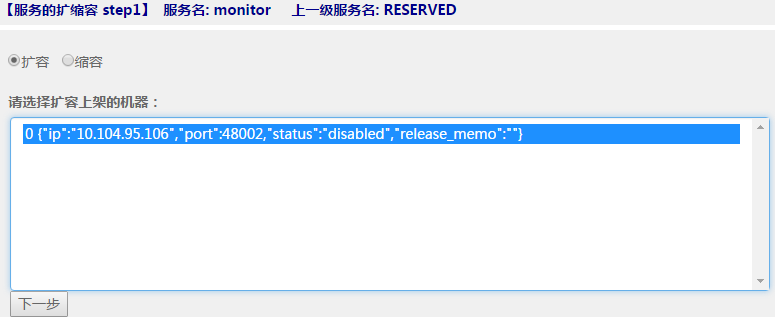
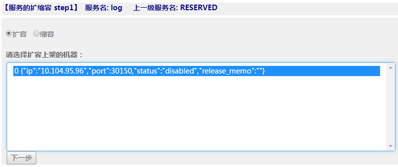

# MSEC安装与部署

MSEC以docker的方式安装整体环境，分为以下几个docker镜像:

|  | 文件名 |
| --- | --- |
| MSEC系统镜像 | msec_console.tar.gz |
| MSEC系统数据 | msec_console_data.tar.gz |

业务进程的每台机器上都需要部署Agent包，以完成业务进程和MSEC系统的交互:

|  | 文件名 |
| --- | --- |
| Agent包 | agent_dist.tar.gz |

# 镜像获取

首先您需要获取以上提及的各个镜像, 及Agent包。

# 部署要求

1.  MSEC管理系统，必须独占1台机器，另外至少1台业务机器。即最小部署要求2台。

2.  MSEC管理系统所在机器内存不小于4G，内存大小决定可监控的信息量

3.  docker要求1.8版本或者以上

4.  业务运营机要求64bit的x86_64架构下的linux，内核版本不低于2.6.18

5.  暂不支持windows mac等其他系统

# docker安装

由于管理系统等都是以docker镜像提供便捷的安装方式，部署时需先安装docker.

这里以centos为例进行说明，执行命令：

```bash
yum install docker
```

一般情况会直接成功，显示Complete\!

但是腾讯云的centos7版本下会报错，需要更新一下lvm2，所以先执行：

```bash
yum install lvm2
```

安装好之后，启动docker：

```bash
service docker start
```

初次启动需要一段时间，要耐心等。以上命令执行完之后，可以检查docker是否运行成功：

```bash
docker ps -a
#result look like:
#CONTAINER ID IMAGE COMMAND CREATED STATUS PORTS NAMES
```

如果运行出现以上结果，说明docker已经运行成功了！

重要的事情再说一遍：**docker要求1.8版本或者以上**

# 管理系统/监控系统/日志系统安装

**硬件需求：内存>=4G**

目前MSEC提供完整的镜像安装，多个子系统集合为单个镜像。

1.  加载docker镜像

	```bash
	gzip –d msec_console.tar.gz
	docker import msec_console.tar centos:msec
	docker images
	#result looks like:
	#REPOSITORY TAG IMAGE ID CREATED VIRTUAL SIZE
	#centos msec 3a9c6f7a9709 59 seconds ago 1.449 GB
	```

2.  解压数据卷, 并移至目录： /msec_data

	```bash
	tar xvf msec_console_data.tar.gz; mv msec_data /msec_data
	```

3.  运行docker镜像

	```bash
	docker run --net=host -d -it -v /msec_data/:/msec --privileged=true -v /etc/localtime:/etc/localtime:ro centos:msec '/etc/rc.d/rc.local'
	```

4.  查看管理系统服务正常

	```bash
	netstat -anop |grep '8080\|8972' |grep LISTEN
	#result looks like:
	#tcp 0 0 0.0.0.0:8972 0.0.0.0:\* LISTEN 7973/java off (0.00/0/0)
	#tcp 0 0 0.0.0.0:8080 0.0.0.0:\* LISTEN 20607/java off (0.00/0/0)
	```

5.  进入管理系统页面查看是否正常, URL为 *http://Console_IP:8080*

	> 登录用户名默认为： msec_user 密码默认为: msec_pass
	> 
	> **登录成功后请立即更改密码**

6.  查看监控系统服务正常

	```bash
	netstat -anop |grep '48002\\|48003' |grep LISTEN
	#result looks like:
	#tcp 0 0 0.0.0.0:48002 0.0.0.0:\* LISTEN 17366/./monitor_ser off (0.00/0/0)
	#tcp 0 0 0.0.0.0:48003 0.0.0.0:\* LISTEN 17366/./monitor_ser off (0.00/0/0)
	```

7.  将监控服务的IP设置到msec console页面中, 并启用服务

	1. 进入msec console主页，选择：异构的外部服务–>RESERVED->monitor(如果没有这个服务，你就在异构服务里创建一级服务叫RESERVED，RESERVED下面创建monitor二级服务)

	2. 在新增IP: port后填入 “安装IP:48002”, 加入IP端口，协议类型选择tcp

		加入成功后：会显示服务为disabled状态, 即还没有上线服务。如下图

		

	3. 点击右上角的”扩缩容”按钮，选择扩容，将新增IP上线。选择下一步

		

	4. 页面提示扩容成功, 选择：异构的外部服务 >> RESERVED >> monitor

		可发现新增IP的服务为enabled状态，即上线成功

		

8.  查看服务正常

	```bash
	netstat -anop |grep '5029\\|30150\\|44445' |grep LISTEN
	#result looks like:
	#tcp6 0 0 :::44445 :::\* LISTEN 27533/docker-proxy off (0.00/0/0)
	#tcp6 0 0 :::5029 :::\* LISTEN 27548/docker-proxy off (0.00/0/0)
	#tcp6 0 0 :::30150 :::\* LISTEN 27540/docker-proxy off (0.00/0/0)
	```

9.  将日志服务的IP设置到msec console页面中, 并启用服务

	1. 进入msec console主页，选择：异构的外部服务 >> RESERVED >> log

	2. 在新增IP: port后填入 “\<安装IP>:30150”, 加入IP端口,协议类型选择tcp

		加入成功后：会显示服务为disabled状态, 即还没有上线服务。如下图

		

	3. 点击右上角的”扩缩容”按钮，选择扩容，将新增IP上线。选择下一步

		

	4. 页面提示扩容成功, 选择：异构的外部服务 >> RESERVED >> log

		可发现新增IP的服务为enabled状态，即上线成功

		

# 业务机器初始化

每台业务机器必须安装Agent包，这样才能和msec系统模块交互。

1.  解压Agent包

	```bash
	tar xvf agent_dist.tar.gz
	```

2.  将agent安装到固定目录，必须是/msec/agent这个目录

	```bash
	mkdir /msec
	mv agent_dist /msec/agent
	```

3.  启动agent, 参数为msec console部署ip, 与msec
    console通信的本机网卡接口名，例如eth0，请根据实际情况填写

	```bash
	/msec/agent/start.sh <webconsole_server_ip> <local_if>
	```

	例如：

	```bash
	/msec/agent/start.sh 10.104.95.110 eth0
	```
