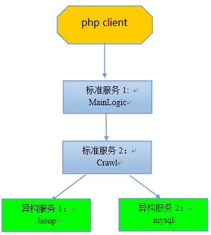
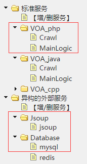
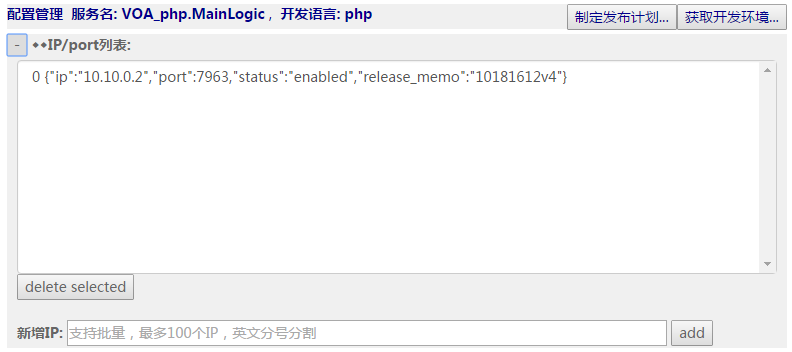
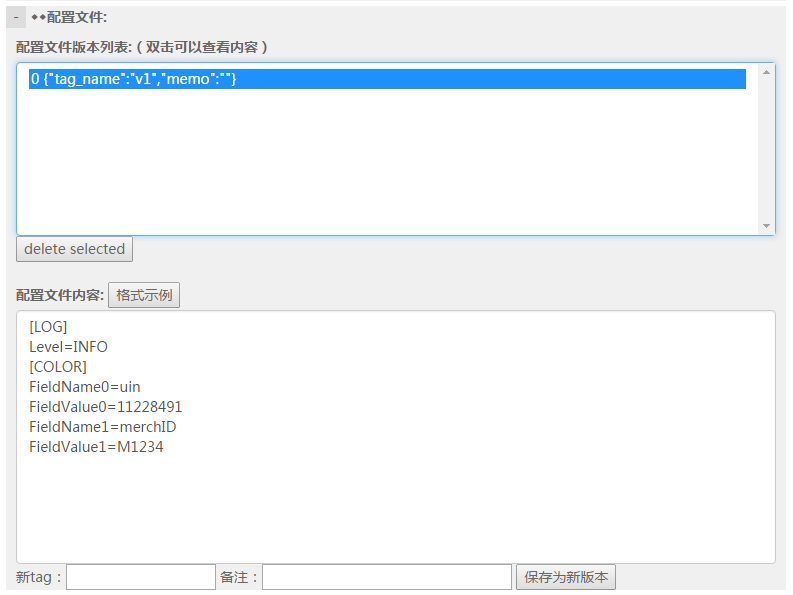
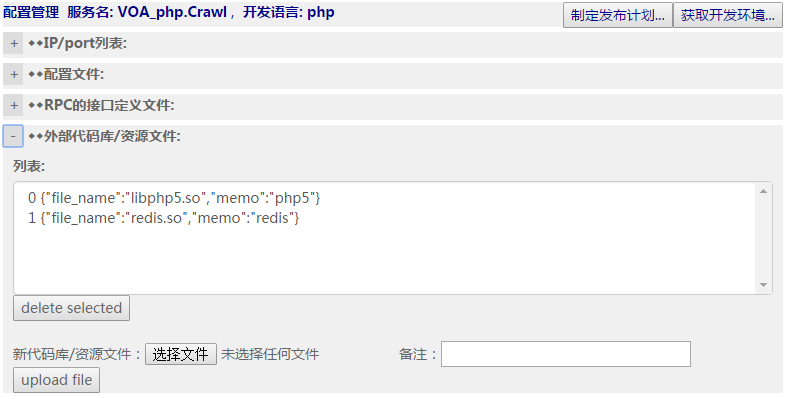
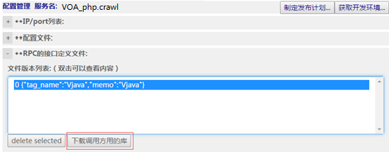
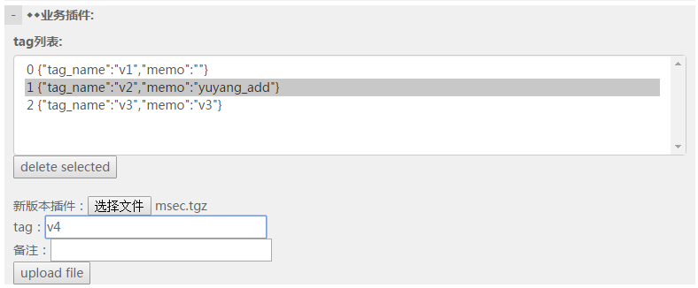
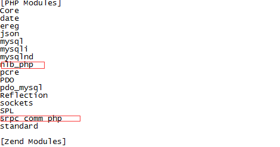
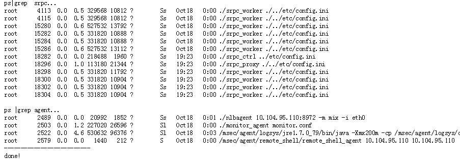

# msec服务开发详解（php）

## 示例的场景描述

这里我们会以一个实际的例子来说明如何基于msec开发一个服务。



如上图所示，业务流程如下：

1.  android客户端访问MainLogic，请求拉取英语听力mp3列表。如果希望通过C/C++（如cgi）访问MainLogic，请参考[msec服务开发详解(cpp)](cpp_dev_guide.md)文档相关章节。

2.  MainLogic收到请求后，转而请求Crawl

3.  Crawl也没有mp3列表，转而请求异构服务Jsoup

4.  Jsoup是一个抓去网上MP3英语听力文件的服务，逐级把mp3列表返回给Crawl和MainLogic

5.  Crawl收到列表后将列表写入mysql，并返回给MainLogic

6.  MainLogic收到mp3列表后，并返回给客户端

**这个例子比较典型，包括好几种远程调用场景：**

1.  场景一：其他模块调用标准服务（android客户端调用MainLogic的GetTitles接口和GetUrlByTitle接口）

2.  场景二：标准服务A调用标准服务B（MainLogic调用Crawl的GetMP3List接口）

3.  场景三：标准服务A调用异构服务B，异构服务B提供接口协议文档的形式（Crawl调用Jsoup）

4.  场景四：标准服务A调用异构服务B，异构服务B提供接口API的形式（Crawl调用mysqld）

5.  场景五：其实还有一种情况，A部门部署了一个msec，B部门也部署了一个msec，A部门的标准服务a调用B部门的标准服务b

## 具体步骤

### Step1：在msec console上添加上述服务

如下所示：



### Step2：配置标准服务

添加MainLogic服务的部署IP：



添加MainLogic服务的配置文件,用默认配置文件即可：



添加MainLogic服务的接口定义文件（protocol buffer方式）：


如果用到其他库文件，例如使用了redis服务，那么可能需要引入phpredis库，那就配置到外部库中



类似的，也配置好标准服务Crawl。这里给一下接口定义文件的文本，方便大家拷贝试做

MainLogic的接口定义文件：

```protobuf
option cc_generic_services = true; // 生成RPC，这行必须加上
option java_generic_services = true; // 生成RPC，这行必须加上
package MainLogic;

message GetTitlesRequest{
	required string type=1;
};

message GetTitlesResponse{
	repeated string titles=1;
	required int32 status = 2;
	required string msg = 3;
};

message GetUrlByTitleRequest{
	required string type=1;
	required string title = 2;
};

message GetUrlByTitleResponse{
	optional string url=1;
	required int32 status = 2;
	required string msg = 3;
};

message DownloadMP3Request
{
	required string type=1;
	required string title = 2;
}

message DownloadMP3Response
{
	required int32 status = 1;
	required string msg=2;
	optional int32 file_len=3;
	optional bytes file_content=4;
}

service MainLogicService{
	rpc GetTitles(GetTitlesRequest) returns (GetTitlesResponse);
	rpc GetUrlByTitle(GetUrlByTitleRequest) returns (GetUrlByTitleResponse);
	rpc DownloadMP3(DownloadMP3Request) returns (DownloadMP3Response);
}
```

Crawl的接口定义文件如下：

```protobuf
option cc_generic_services = true; // 生成RPC，这行必须加上
option java_generic_services = true; // 生成RPC，这行必须加上
package crawl;

message OneMP3
{
	required string title = 1;
	required string url = 2;
}

message GetMP3ListRequest{
	required string type=1; //标准英语还是慢速英语
};

message GetMP3ListResponse{
	repeated OneMP3 mp3s=1;
	required int32 status=2;
	required string msg=3;
};

service CrawlService {
	rpc GetMP3List(GetMP3ListRequest) returns (GetMP3ListResponse);
}
```

### Step3：开发标准服务MainLogic

1. 点击MainLogic服务的“获取开发环境”的按钮，下载开发包

	

2. 在开发机上展开，进入到MainLogic_server目录

	

3. 因为MainLogic服务访问Crawl，所以还需要用到Crawl的接口API，如何获得呢？

	在Crawl的配置页面那里，下载调用方用到的库：

	

	下载后可以看到里面的crawl_php文件夹下有pb_proto_VOA_php_Crawl.php文件，将这个文件放到MainLogic服务开发机的的目录MainLogic_server下，我们就可以调用Crawl服务提供的接口。

	修改MainLogicService.php，增加业务代码，并`require_once pb_proto_VOA_php_Crawl.php`文件。

	其中值得关注的是如何访问Crawl服务，也就是场景二：标准服务调用标准服务：

	```php
	public function GetUrlByTitle($request, $isJson)
	{
		if($isJson) {
			//not supported...
			$response = "{\"status\":-1000, \"msg\":\"Json not supported\"}";
			return $response;
		}

		/* pb部分，反序列化请求包体 */
		$req = new GetUrlByTitleRequest();
		$req->ParseFromString($request);
		$rsp = new GetUrlByTitleResponse();

		// TODO: 业务逻辑实现
		nglog_info("GetUrlByTitle start....\n");
		attr_report("GetUrlByTitle Entry");

		$getMP3ListRequest = new GetMP3ListRequest();
		$getMP3ListRequest->set_type("special");
		$getMP3ListResp = new GetMP3ListResponse();
		$ret = 0;

		if(self::$use_php) {
			$ret = callmethod("VOA_php.Crawl", "crawl.CrawlService.GetMP3List",
			$getMP3ListRequest->serializeToString(), 15000);
		}
		else {
			$ret = callmethod("VOA_java.Crawl", "crawl.CrawlService.getMP3List",
			$getMP3ListRequest->serializeToString(), 15000);
		}

		if ($ret['errmsg'] != 'Success')
		{
			$rsp->set_msg('callmethod failed:'.$ret['errmsg']);
			$rsp->set_status(100);
			nglog_error('callmethod failed:'.$ret['errmsg']."\n");
			goto label_end;
		}
		nglog_info("callmethod successfully\n");

		$getMP3ListResp->ParseFromString($ret['rsp']);
		if ($getMP3ListResp->status() != 0)
		{
			$rsp->set_msg('rpc failed:'.$getMP3ListResp->msg());
			$rsp->set_status(100);
			nglog_error('rpc failed:'.$getMP3ListResp->msg()."\n");
			goto label_end;
		}
		nglog_info("rpc return status=0\n");

		$rsp->set_msg("failed to find the url");
		$rsp->set_status(100);
		nglog_info("begin scan mp3 list...");
		for ($i = 0; $i < $getMP3ListResp->mp3s_size(); $i++)
		{
			$oneMP3 = $getMP3ListResp->mp3s($i);
			$title = $oneMP3->title();
			$url = $oneMP3->url();
			if ($req->title() === $title)
			{
				$rsp->set_url($url);
				$rsp->set_msg("success");
				$rsp->set_status(0);
				nglog_info("GetUrlByTitle end successfully.\n");
				attr_report("GetUrlByTitle Success");
				break;
			}
		}

		label_end:
		/* 序列化回复包体 */
		$response = $rsp->serializeToString();
		return $response;
	}
	```

	为了方便直接拷贝试用，这里给出了完整文件：[MainLogicService.php](examples/dev_php/MainLogicService.php)

### Step4：编译MainLogic服务

我们对代码在linux上执行`./build.sh`，生成msec.tgz这样一个业务插件。将该业务插件上传到msec console：



### Step5：开发标准服务Crawl

类似MainLogic，也是从msec
console下载crawl服务的开发环境，并在开发机上展开，修改msg_crawl_impl.cpp文件，增加业务逻辑。

Crawl服务的业务逻辑比较简单，访问Jsoup这个异构服务，拉取一个英语mp3文件的(文件标题， 文件url)的列表。

这里值得特别注意的是：这是场景三：标准服务访问一个异构服务，该异构服务提供了接口协议文档。

首先，配置Jsoup的IP并扩容到负载均衡管理系统里：


然后就写代码如下：

```php
$jsonReq = sprintf("{\"handleClass\":\"com.bison.GetMP3List\", \"requestBody\": {\"type\":\"%s\"} }", $req->type());
$lenStr = sprintf("%-10d", strlen($jsonReq));
$jsonReq = $lenStr.$jsonReq;
nglog_info("begin to call jsoup:".$jsonReq."\n");

$jsonResp = "";
$errmsg = "";
$ret = callmethod_odd("Jsoup.jsoup", $jsonReq, $jsonResp, $errmsg, "callback", 10000000);

if ($ret != 0)
{
	$rsp->set_msg($errmsg);
	$rsp->set_status(100);
	nglog_error("call jsoup failed:".$errmsg."\n");
	goto label_end;
}
nglog_info("call jsoup success\n");
```

这里的关键就是通过路由服务获取业务对应的ip，然后通过PHP网络调用函数收发获取业务数据，最后完成解包。

另一个值得关注的是如何访问mysql服务，也就是场景四：标准服务调用异构服务

首先配置异构服务mysql的IP列表，并通过扩缩容操作，将新加入的IP扩容到负载均衡系统里，这样就能被其他服务访问到。点击右上角的扩缩容按钮。该IP的状态由disabled变成enabled


然后写代码如下，我们使用了php的mysqli类。

```php
$dbinfo = getroutebyname("Database.mysql");
$dbconn = mysqli_connect($dbinfo["ip"],$dbuser, $dbpass, $dbname,
$dbinfo["port"]);
if (!$dbconn)
{
	nglog_error("db connect fails.\n");
	goto label_end;
}

$query = "INSERT INTO mp3_list(title, url) VALUES (?,?)";

foreach ($mp3s as $mp3) {
	$stmt = $dbconn->prepare($query);
	$stmt ->bind_param("ss", $mp3->{'title'},
	$mp3->{'url'});
	$stmt->execute();
	$stmt->close();
}

//close
$dbconn->close();
```

关于通过lb路由服务获取业务ip信息，主要的api如下：

getroutebyname通过业务名获取路由信息；updateroute更新路由统计信息，用于lb做回包统计。如果不需要回包统计做动态路由，可以不用调用updateroute。

为了方便拷贝试做，这里给出完整文件：[CrawlService.php](examples/dev_php/CrawlService.php)

### Step6：PHP客户端访问MainLogic标准服务

首先从MainLogic的配置页面下载调用方用的库：


下载下来后，里面包含了访问该pb接口的客户端API，支持C++/Java/PHP等语言。因为是php开发，所以我们用php的api：

1.  展开下载的tar包，找到文件srpc_comm_php.so，进入该文件所在目录

2.  写一个test.php文件，代码见下文

3.  如果没有，请安装php解释器，版本要求5.6.x

4.  编辑/etc/php.ini，加入扩展

	（1.0版本因为疏忽，漏了一个文件，请从MainLogic业务运营机的/msec/VOA_php/MainLogic/bin/lib目录下拷贝nlb_php.so到当前目录下）

	> extension=nlb_php.so的绝对路径
	> 
	> extension=srpc_comm_php.so的绝对路径

5.  调用php -m, 看扩展是否加载成功

	

6.  需要设置环境变量LD_LIBRARY_PATH

	```bash
	export LD_LIBRARY_PATH="$LD_LIBRARY_PATH:."
	```

7. 执行`php test.php`，可以成功调用 MainLogic服务

	test.php的主要逻辑是调用MainLogic模块：

	```php
	require_once 'pb4php/message/pb_message.php'; // pb4php文件
	require_once 'pb_proto_msec.php'; // 自动生成的pb文件

	$request = new GetTitlesRequest();
	$request->set_type("standard");
	$body_str = $request->serializeToString();
	$seq = rand();

	// 打包示例
	$req_pkg = srpc_serialize("MainLogic.MainLogicService.GetTitles", $body_str, $seq);
	if ($req_pkg === null)
	{
		echo "srpc_pack failed";
		return -1;
	}
	```

	发出请求后，流式传输层接收应答的处理：

	```php
	//业务收发包: 伪代码
	$rsp_pkg = send_rcv($addr, $req_pkg);
	```

	收到应答后，拆解出rpc隐含的头部、包体，进行解析

	```php
	$ret = srpc_deserialize($rsp_pkg);

	if (($ret['errmsg'] !== 'success') && ($ret['errmsg'] !=='Success'))
	{
		echo "srpc_unpack failed ", $ret['errmsg'];
		return -2;
	}

	if ($ret['seq'] != $seq)
	{
		echo "the sequence is inconsistent";
		return -3;
	}

	$body_str = $ret['body'];
	$response = new GetTitlesResponse();
	$response->ParseFromString($body_str);
	var_dump($response);
	```

	这里主要关注SRpcPrxy类下的三个接口：

	`string srpc_serialize(string service_name, string request, int seq)`用于组包

	`int srpc_check_pkg(string response)` 用于判断包的完整性

	`array srpc_deserialize(string response)` 用于解包

	为了方便拷贝试做，这里给出客户端文件：[test.php](examples/dev_php/test.php)

注意：这就是场景一：外部模块调用标准服务。

另外专门说一下场景五：不同msec实例之间的标准服务的相互调用

假设msec_A下的标准服务a调用msec_B下的标准服务b，那么

1.  在msec_A的console管理页面里配置一个异构服务，假设叫msec_B.b，将IP配置进去，并扩容到负载均衡系统里

2.  找msec_B下载调用方用的库，获得b的接口调用API

3.  就像场景二(Step 3)一样的编码，用CallMethod发起对msec_B.b 这个服务的访问即可

### Step7：发布标准服务

首先，确保要发布的业务运营机环境已经安装了毫秒的agent并启动ok，详细见[msec是什么](msec_in_a_nutshell.md)文档里的第一步：机器准备环节

然后点击“制定发布计划”按钮，一步一步选择要发布的目标IP、业务插件等等


然后在菜单“运维->发布”里查找到刚才建立的发布计划，如果状态显示为create
successfully，就可以点击“详细”进去执行发布


发布成功的话，应该能看到srpc进程启动了，四个agent进程也在运行



完成发布后，如果业务服务起IP的状态还是disabled，那意味着没有进入负载均衡系统对外服务，这个时候通过菜单“运维->容量”查询并做扩缩容操作，成功后，对应IP状态变为enabled


类似的，标准服务Crawl也是如此发布并扩容。

