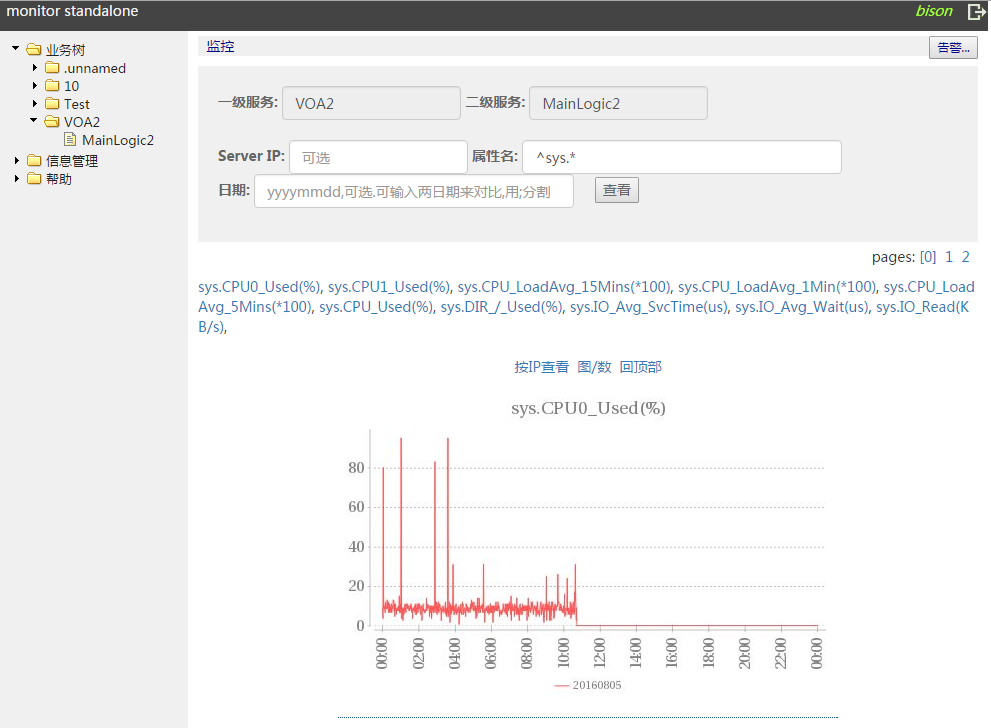
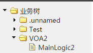

#监控系统（单品）安装部署和开发文档

监控系统以docker的方式安装整体环境，分为以下docker镜像文件和数据文件:

|  | 文件名 |
| --- | --- |
| 监控系统镜像文件 | monitor_standalone.tar.gz |
| 监控系统数据文件 | monitor_standalone_data.tar.gz |

业务进程的每台机器上都需要部署Agent包，以完成业务进程和监控系统的交互:

|  | 文件名 |
| --- | --- |
| Agent包 | monitor_standalone_agent.tar.gz |
| C/C++ API库包 | monitor_standalone_c_api.tar.gz |
| Java API库包 | monitor_standalone_java_api.jar |

# 一、镜像获取

首先您需要获取以上提及的镜像文件、数据文件及Agent包。

# 二、部署要求

监控系统所在机器内存不小于8G，内存大小决定可监控的信息量，监控系统默认会使用系统80%的内存。

内存使用估算如下：如系统有 500台机器上报，每台每天报200个属性，每个属性占用6k（1.4k分钟，每个分钟用4字节整数），50%的内存利用率。保存5天的数据就需要内存：

0.5k * 0. 2k * 6k * 5 * 2 = 6GB

# 三、安装说明

## 3.1 docker安装

由于监控系统等都是以docker镜像提供便捷的安装方式，部署时需先安装docker。

这里以centos为例进行说明，执行命令：

```bash
yum install docker
```

一般情况会直接成功，显示Complete!

但是腾讯云的centos7版本下会报错，需要更新一下lvm2，所以先执行：

```bash
yum install lvm2
```

安装好之后，启动docker：

```bash
service docker start
```

初次启动需要一段时间，要耐心等。以上命令执行完之后，可以检查docker是否运行成功：

```bash
docker ps -a
#result looks like:
#CONTAINER ID IMAGE COMMAND CREATED STATUS PORTS NAMES
```

如果运行出现以上结果，说明docker已经运行成功了！

特别注意：docker要求1.8或者以上的版本

## 3.2 监控系统安装

1.  加载docker镜像

	```bash
	docker import monitor_standalone.tar.gz centos:monitor_standalone
	docker images
	#result looks like:
	#REPOSITORY TAG IMAGE ID CREATED VIRTUAL SIZE
	#centos monitor_standalone 3a9c6f7a9709 59 seconds ago 1.019 GB
	```

2.  解压数据卷, 并移至目录： /monitor_data

	```bash
	tar xvf monitor_standalone_data.tar.gz; mv monitor_data /monitor_data
	```

3.  运行docker镜像

	```bash
	docker run --net=host --ipc=host -d -it -v /monitor_data/:/monitor_standalone --privileged=true -v /etc/localtime:/etc/localtime:ro centos:monitor_standalone '/etc/rc.d/rc.local'
	```

4.  查看服务正常

	```bash
	netstat -anop |grep '8080\|38002' |grep LISTEN
	#result looks like:
	#tcp 0 0 0.0.0.0:8080 0.0.0.0:* LISTEN 70/java off (0.00/0/0)
	#tcp 0 0 0.0.0.0:38002 0.0.0.0:* LISTEN 260/./monitor_server off (0.00/0/0)
	```

5.  进入监控系统管理页面查看是否正常, URL为http://Console_IP:8080

## 3.3 业务机器Agent安装

每台业务机器必须安装Agent包，这样才能和监控系统交互。

1.  解压Agent包并放置于/msec/agent/目录，注意：agent目录必须为/msec/agent/monitor目录

	```bash
	tar xvf monitor_standalone_agent.tar.gz -C /msec/agent/monitor
	```

2.  启动agent, 请修改monitor.conf配置，将<server>ip/port参数为监控系统部署ip/port，使用`./start.sh`启动即可，agent成功启动会显示如下信息。
	
	```bash
	./start.sh
	#result looks like:
	#Monitor agent started
	```

3.  agent同时提供test_set和test_get命令行用于测试设置/获取monitor数据，请修改ip.conf配置为监控系统的ip/port：

	```bash
	#设置业务TestSvc.TestSvc，属性名rpc.update的监控项
	./test_set TestSvc.TestSvc rpc.update
	#获取该业务下的属性和IP详情
	./test_get 1 TestSvc.TestSvc 
	#获取监控业务目录树
	./test_get 10
	```

> 用户可参考命令行帮助获取更多输入参数信息，同时也可实时在监控系统管理页面中查看具体业务的监控视图。

# 四、监控管理页面介绍

## 4.1登录与账号管理

系统预置了一个账号：
> 1.0版本及之前 预置登录用户名为： bison，密码为: 123456
> 
> 1.0版本后 预置登录用户名为： msec_user 密码为: msec_pass 

用该账号登录后，需要立即改密，并增加需要的其他账号。

## 4.2 监控视图

点击业务树的具体服务可以查看服务上报属性的监控，默认服务装了agent的话会同时上报机器的基础信息。也可以根据IP、日期、基于正则表达式的属性名对上报属性进行过滤查看。



## 4.3 告警管理

点击右上角的“告警”可以查看当前服务的监控告警情况，用户可以按属性及告警类型设置告警。告警类型分为“超过最大值”、“低于最小值”、“波动绝对值过大”、“波动百分比过大”四类，其中波动告警是和前一天数据进行比较。

如我们对CPU0的监控设置了一个最大值告警，则在告警查看页中会看到相关告警。


告警数据已入DB，对应的数据表为数据库alarmdb的alarm，对应的表结构如下：

| 字段 | 含义 |
| --- | --- |
| servicename | 服务名 |
| attrname | 属性名 |
| createtime | 告警创建时间（非重要） |
| alarmtime | 告警触发时间 |
| servicename | 告警类型：<br/>1：超过最大值<br/>2：低于最小值<br/>3：波动绝对值过大<br/>4：波动百分比过大 |
| current_num | 触发时的监控上报量 |
| alarm_num | 告警设置阈值 |

用户可以基于页面/DB进行简单的二次开发，接入用户自身服务的邮件/短信系统查收告警。

# 五、业务开发流程

## 5.1 监控系统业务名命名规则

监控系统需要业务上报业务名和属性名。业务名遵循点分二级命名规则，用于在监控系统管理页面上的分级树状显示，请保证业务名和属性名为utf8编码，使用英文、数字、下划线(_)或utf8中文汉字，长度不超过64字节，否则会引起管理页面菜单显示混乱。如业务名为VOA2.MainLogic2，则对应树状显示的一级菜单为VOA2，二级菜单为MainLogic2，如下图所示。如果一级菜单或二级菜单名称为空，则会统一放置到“.unnamed”一级菜单下，如业务名为“.Test”，“Test.”等。



## 5.2 C/C++业务

从API包中获取C/C++业务代码，并在代码开发/编译时包含对应的api头文件/库。简单的示例代码片段如下：

```C++
#include "monitor_client.h"
std::string servicename, attrname; //业务名和上报属性名
int ret = Monitor_Add(servicename.c_str(),attrname.c_str(), 1);//累加上报API，上述代码对属性加1，监控系统按分钟根据上报属性汇总数据。
if(ret != 0)
	printf("[ERR]%s|%s|%d\n", argv[1], argv[2], ret);
```

业务侧可以使用宏对业务名进行二次封装，生成如下更简化的代码：

```C++
#define SERVICENAME "SERVICEROOT.SERVICENAME"

#define REPORT(ATTRNAME) Monitor_Add(SERVICENAME, ATTRNAME, 1);

REPORT("Function");
```

## 5.3 Java业务开发流程

使用提供的Java jar包，示例代码片段如下：

* 初始化

```java
//API与Agent采用mmap文件通信，必须传入mmap文件的路径
AccessMonitor.initialize("/msec/agent/monitor/monitor.mmap");
//设置上报的模块名
AccessMonitor.initServiceName("ModuleName");
```

* 累加上报API

```java
AccessMonitor.add("test"); // test为上报属性名
AccessMonitor.add("test", 11); // test为上报属性名,11为累加值
```

* 覆盖上报API

```java
AccessMonitor.set("test", 100); // test为上报属性名 100为上报值
```