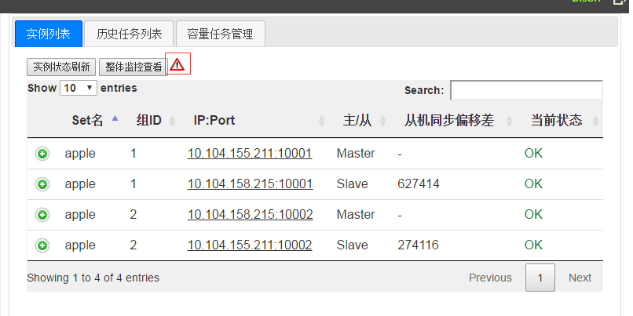
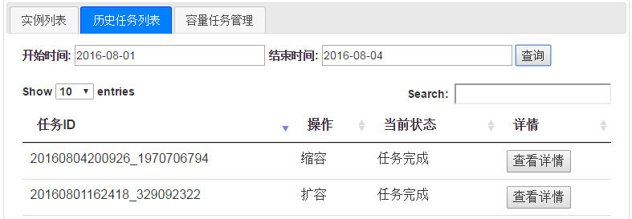
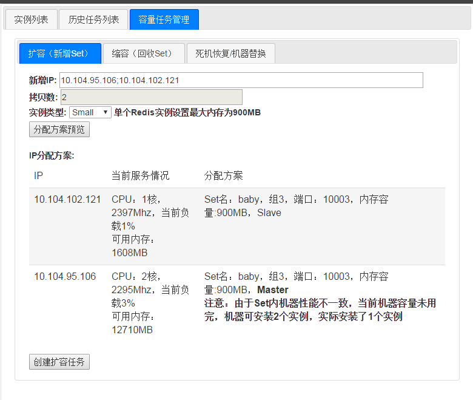
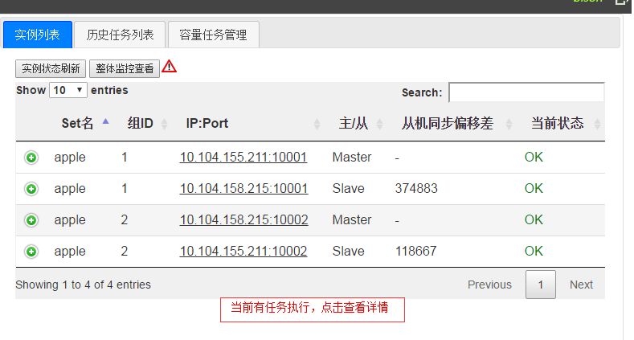
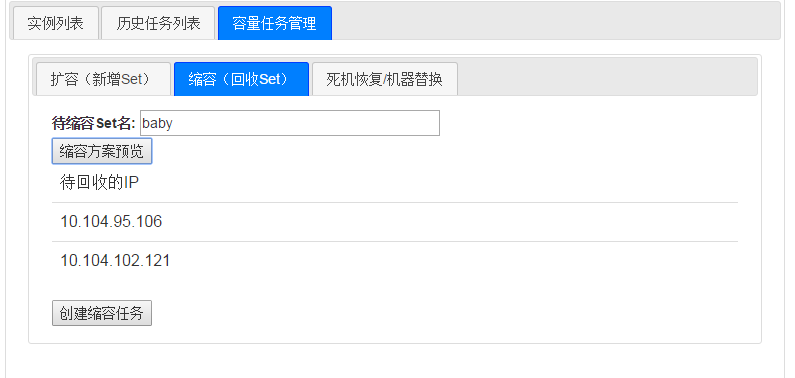
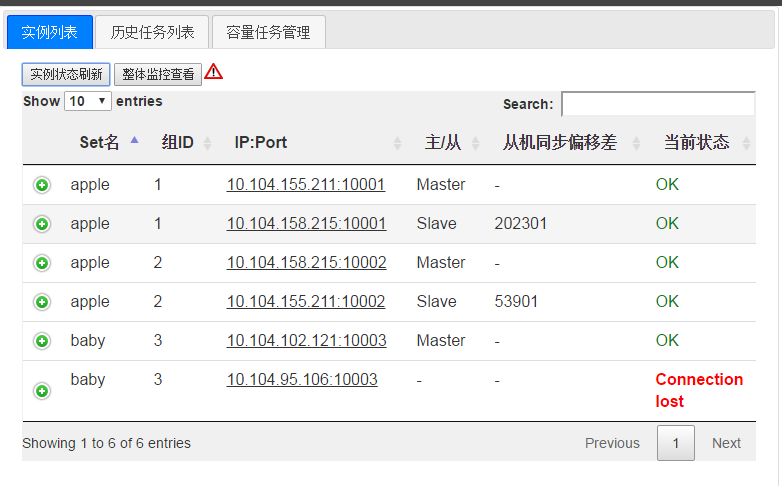
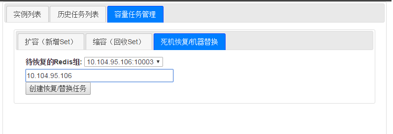
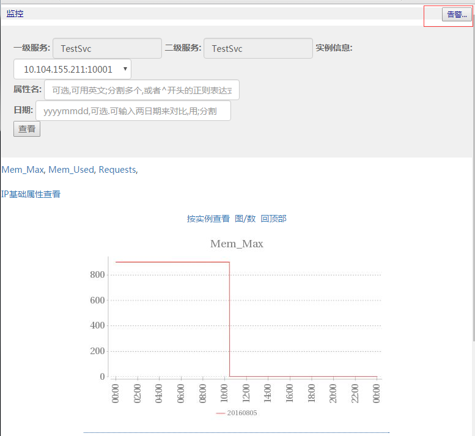

# Redis console安装和使用说明文档

*注意：Redis console只支持chrome浏览器，其他浏览器都没有测试。*

# 一、安装

## 1.1 docker安装

由于监控系统等都是以docker镜像提供便捷的安装方式，部署时需先安装docker.

这里以centos为例进行说明，执行命令：

```bash
yum install docker
```

一般情况会直接成功，显示Complete!

但是腾讯云的centos7版本下会报错，需要更新一下lvm2，所以先执行：

```bash
yum install lvm2
```

安装好之后，启动docker：

```bash
service docker start
```

初次启动需要一段时间，要耐心等。以上命令执行完之后，可以检查docker是否运行成功：

```bash
docker ps -a
#result looks like:
#CONTAINER ID IMAGE COMMAND CREATED STATUS PORTS NAMES
```

如果运行出现以上结果，说明docker已经运行成功了！

特别注意：docker要求1.8或者更高的版本

## 1.2 Redis console系统安装

1. 加载docker镜像

```bash
docker import redis_console.tar.gz centos:redis_console
docker images
#result looks like:
#REPOSITORY TAG IMAGE ID CREATED VIRTUAL SIZE
#centos redis_console 3a9c6f7a9709 59 seconds ago 957.2 MB
```


2. 解压数据卷, 并移至目录： /redis_console_data

```bash
tar xvf redis_console_data.tar.gz; mv redis_console_data redis_console_data
```

3.  运行docker镜像

```bash
docker run --net=host --ipc=host -d -it -v /redis_console_data/:/msec --privileged=true -v /etc/localtime:/etc/localtime:ro centos:redis_console '/etc/rc.d/rc.local'
```

4.  查看服务正常

```bash
netstat -anop |grep '8080\|38002\|9982' |grep LISTEN
#result looks like:
#tcp 0 0 0.0.0.0:9982 0.0.0.0:* LISTEN 2326/java off (0.00/0/0)
#tcp 0 0 0.0.0.0:8080 0.0.0.0:* LISTEN 2359/java off (0.00/0/0)
#tcp 0 0 0.0.0.0:38002 0.0.0.0:* LISTEN 2815/./monitor_serv off (0.00/0/0)
```

5.  进入监控系统管理页面查看是否正常, URL为 http://Console_IP:8080


# 二、使用说明

## 2.1登录与账号管理

系统预置了一个账号：
> 1.0版本及之前 预置登录用户名为： bison，密码为: 123456
> 
> 1.0版本后 预置登录用户名为： msec_user 密码为: msec_pass 

用该账号登录后，需要立即改密，并增加需要的其他账号。


## 2.2服务配置管理

服务名字空间是树状的方式维护，有且只有两级。Redis服务的配置及状态展现，包括：

1.  IP/Port列表：配置该服务部署到哪些机器上面，通过扩容、缩容流程进行cluster的容量管理；同时可以实时展现当前服务状态；

> *服务是以Set形式进行容量管理，一个Set的机器数为初始化时设置的拷贝数，扩容和缩容都需要一次性增加、去除一个或多个Set。*

2.  扩容管理：增加一个/多个Set。

3.  缩容管理：去除一个Set。

4.  死机恢复/机器替换管理：可以对死机机器进行恢复或使用新机器替换。

> *注意：如果使用新机器替换死机机器，新机器只能服务一个Set。*


实例列表按钮旁的三角形图标出现说明当前服务有一定风险，点击会提示用户当前服务的可能的问题（如部分hash slot拷贝数不足等问题）。

点击加号可以对当前实例进行一定的远程命令操作，如查看实例详细状态、进行主从切换等。

## 2.3 历史任务列表

历史任务列表列举了指定时间段内的流程操作及完成状态，可以点击详情查看具体操作的执行情况。



## 2.4 初始化/扩容流程

待初始化/扩容机器首先需要安装Remote shell agent。如果没有对秘钥进行变动的话，可在页面左侧“客户端Agent下载”栏目中下载agent并安装到待扩容机器上。

输入待扩容机器IP后，页面会根据带扩容机器的性能自动分配redis实例。



确认ok点击“创建扩容任务”页面会生成扩容任务。扩容会对机器进行Redis Cluster实例安装以及hash slot分配。分配会在迁移最少hash slot的基础上保证每个Set的hash slot数尽可能平均。用户可以在历史任务列表或点击列表下面的任务进度栏查看任务进展。*注意：同一时刻只允许一个任务执行。*



完成分配后， IP/Port列表页面会自动刷新。

*注意：为了确保Redis cluster的主从自动切换能生效，请确保服务的50%的master实例不会聚集在同一个IP上，否则三角形图标会出现。*

## 2.5 缩容流程

缩容流程可以对指定Set名下的机器的Redis cluster实例移除。



页面会开始操作进行机器hash slot重分配。分配会在迁移最少hash slot的基础上保证每个Set的hash slot数尽可能平均。完成后实例会自动停止服务。

*注意：如果仅有一个Set，对这个Set进行缩容会报错，这种场景直接下线服务即可。*

## 2.6 死机恢复/机器替换流程

死机恢复流程可以用于对一台有问题的机器进行恢复或使用新机器替换，如果使用新机器替换，管理平台会校验新机器只用于单一Set。*注意：这里的死机恢复替换的是一台已经挂了或死机重启的从机，需要重新安装Redis cluster实例，数据需要重新同步*。





恢复后服务正常。

## 2.7 监控页面

用户可以点击实例列表的“整体监控查看”查看服务的总体监控视图，或者点击当个实例的IP:Port查看单机视图。



点击右上角的“告警”可以查看当前服务的监控告警情况，用户可以按属性及告警类型设置告警。告警类型分为“超过最大值”、“低于最小值”、“波动绝对值过大”、“波动百分比过大”四类，其中波动告警是和前一天数据进行比较。

# 三、后台程序和数据

## 3.1关键程序

有三个后台关键程序，在docker镜像执行的时候，通过运行`/etc/rc.d/rc.local`脚本启动了这三个程序。

### 3.1.1 mysql

我们使用mysql保存Redis站点的数据

路径：/usr/local/mysql

主要程序/文件: bin/mysqld_safe bin/mysql

端口号：3306

### 3.1.2 remote_shell

我们使用remote_shell对业务运营机进行管理，可以传输文件、执行命令

路径：/usr/local/remote_shell

主要程序/文件：server.jar priv.txt

端口号：9982

特别说明：部署在业务运营机上的remote_shell_agent通过公钥密码算法实现对remote_shell server进行身份认证，priv.txt文件就是remote_shell server的身份文件，安装remote_shell_agent后需要立即进行更换并保密，具体做法见本文档的`4.2 remote shell身份认证`

### 3.1.3 tomcat

我们的console站点使用tomcat作为Redis console服务器

路径：/usr/local/tomcat-8

主要程序/文件：位于webapp/ROOT下

端口：8080

## 3.2 关键数据

/msec/console_log是站点的log所在目录 log.log和err.log是当前的log

/msec/mysqldata mysql里数据的存储目录

/msec/tomcat_log tomcat的log目录

# 四、业务机Agent安装

## 4.1 agent包下载和安装

业务机需要部署Agent才能完成和Console之间的交互以及监控数据的上报。请在页面“客户端Agent下载-下载”中获取Agent包，并放置于redis业务机的/msec/agent/目录里。

将下载包解压，使用`/msec/agent/start.sh ip`启动agent，其中ip参数为redis console的内网IP。

## 4.2 remote shell身份认证

部署在业务运营机上的remote_shell_agent接受Redis console服务器上的remote_shell server.jar程序的管理，server.jar可以向agent发送文件、从agent获取文件、让agent执行一个脚本。

如果坏人恶意冒充server.jar，就可以对装有remote_shell_agent的机器为所欲为。

为了安全起见，server.jar和remote_shell_agent之间通过公钥密码算法对server.jar进行身份认证，即要求server.jar使用一个事先约定的保密的私钥对欲执行的命令脚本进行数字签名。Server.jar所在目录下的priv.txt就是私钥文件，而业务运营机的/msec/agent/remote_shell目录下的pub.txt文件就是公钥文件。

remote_shell环境搭建好以后，为了安全起见，可以重新生成priv.txt和pub.txt文件并分发到正确的目录下：

1. 执行`java -jar server.jar newRSAKey`，生成两个文件priv.txt和pub.txt，是新的密钥文件
2. 将 pub.txt分发到所有业务运营机的/msec/agent/remote_shell目录下，并重新启动remote_shell_agent。因如果更新了pub.txt，请同步更新页面客户端agent下载包，因为是使用docker，建议将这个改动commit到centos:redis_console镜像。
3. 重新启动Redis console上的remote_shell

注意：后续部署新的业务运营机的agent，都需要使用新生成的pub.txt文件

